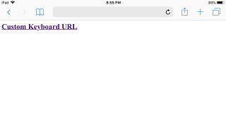
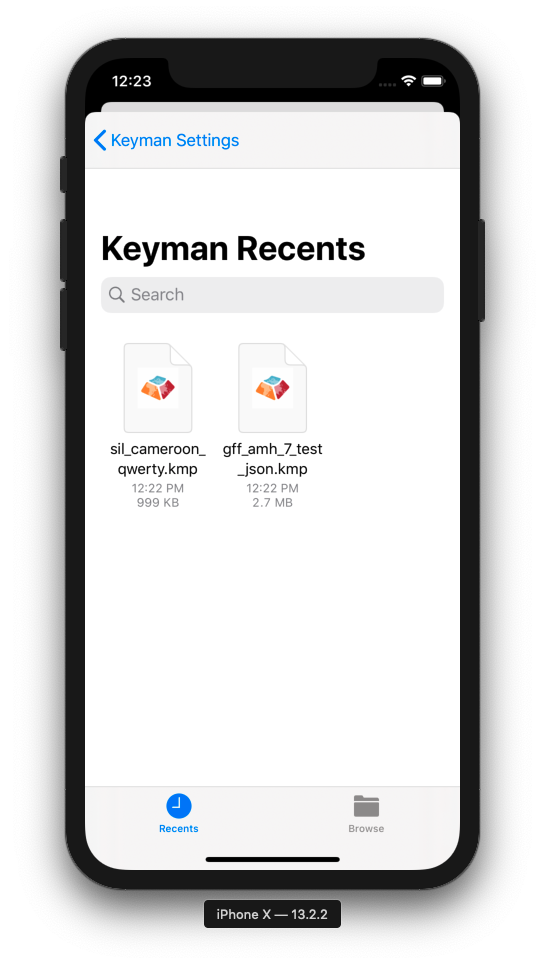
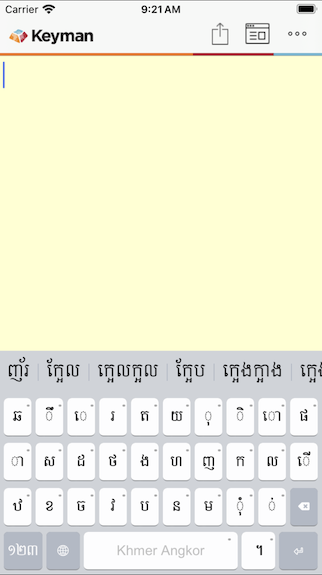

The following steps can be used to install either a keyboard package or a dictionary package.

### Download the File
If downloading a custom keyboard from the internet, click the link to your custom keyboard package file.

For this example, we'll install a custom keyboard from a link in Safari.  Our example keyboard is for the GFF Amharic 7 keyboard.

Safari will display an option to open the KMP file with Keyman.

Click **Open in "Keyman"** to continue.

### Finding the File (iOS 13+ only)
Installation is also possible from email clients and other sources.
Once you download the file and save it to your device, look for an
**Open in "Keyman"** option or use the
Install From File option in Keyman seen below.

Once this option is selected, a file browser will appear.  By default, it will show the most
  recently downloaded files that can be installed.

If you have difficulty finding the right file, consider using the **Browse**
option at the bottom-right.  Once you select it, you should then be greeted with the screen shown in
the section below.

### Installing the Package
Either approach seen above will start the installation process.  From there, Keyman
for iPhone and iPad will parse the metadata in the package. Some packages include
documentation that will be displayed at this time.

Click the **"Install"** button at the top right.

The keyboard from the keyboard package will then be successfully installed!

All the keyboards in the package are installed as a group. In this example, the package only has the "GFF Amharic 7"
keyboard, so it becomes the active keyboard.

To learn how to create a custom installable keyboard, [click here](http://help.keyman.com/developer/current-version/guides/distribute/).
