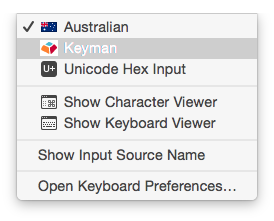

*Keyman for macOS* is available for [downloaded](https://keyman.com/mac/download) as a standard
Apple Disk Image (.dmg) file. It should be installed according to the following instructions.

[ Watch Video](https://youtu.be/7Ax71QeUNfo)

1. Double click the DMG file to open it in Finder.
2. Double click the **Install Keyman** icon to open the Keyman installer.
3. You will be prompted to install Keyman. Follow the prompts to complete installation.

4. Keyman should now be an option in the Input Sources menu towards the right hand
   side of the menu bar.

   

   **Note**: On recent versions of macOS, the first time you enable Keyman by selecting Keyman
   from the menu, you will be prompted to give certain permissions to Keyman. It is
   important that you allow Keyman these permissions, otherwise it will not be able
   to remap the keyboard. [More information on permissions](../troubleshooting/configure-security)

4. Click the input menu and switch to Keyman. Click the input menu again to see the
   installed keyboards in Keyman:Keyboards menu.

   This will show "(None)" at first. You may switch to another keyboard from this menu,
   once they are installed.

   See [Install a Keyman Keyboard](install-keyboard) to learn how to install keyboards.

5. Now you can start typing with the selected keyboard in any text editor or
   application that uses standard macOS input methods.

---

If you're using Homebrew, you can also install Keyman with the command:

1.
```
brew install --cask keyman
```

2. Configure the macOS [security permissions](../troubleshooting/configure-security) for Keyman to run.

----
## How To - Updating Keyman for macOS

When a new version of Keyman is released, you can update by following the instructions
above.

**Note**: To uninstall Keyman for macOS, follow the steps in [Uninstall Keyman](../troubleshooting/uninstall-keyman).
