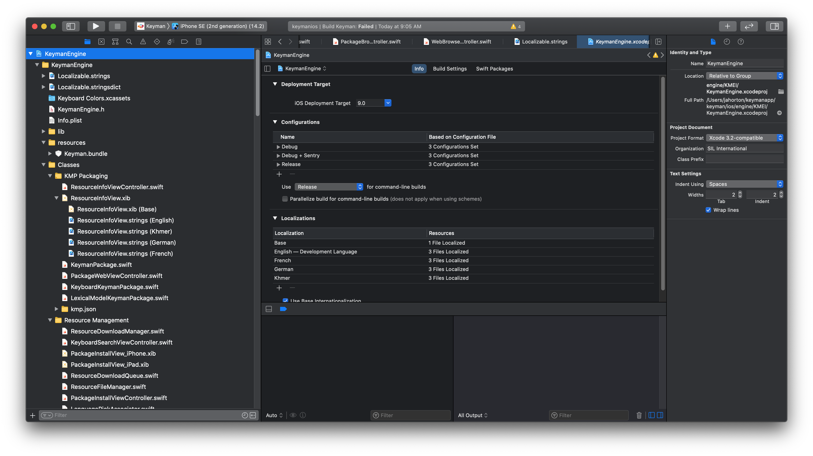
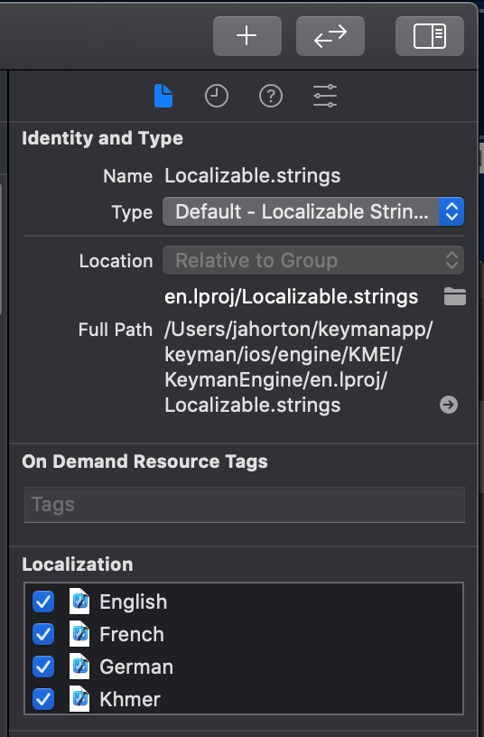

# Localization Maintenance

Localization for Keyman is maintained at https://translate.keyman.com

Downloading and updating files between Keyman and Crowdin happens automatically
on GitHub by way of the Crowdin git integration. The configuration file for all platforms
is a YAML file named `/crowdin.yml`. Currently, the git integration tracks the `master` branch.

For most of our platforms, the only thing that needs to be done manually is to update `crowdin.yml` if new files get added
(and of course translating the strings on the [Crowdin website](https://crowdin.com/project/keyman)).

## Manual upload and download with Crowdin CLI

The following describes how alternatively the Crowdin CLI (v3) tool could be used to
automate downloading and updating files between Keyman and Crowdin.

On Windows, use `crowdin.bat` instead of `crowdin` for all the syntax below.

### Add File

When adding new files to https://crowdin.com/project/keyman/settings#files
also go to the file "Settings" and edit **Resulting file after translations export:**.
This is where the translated files will appear in the Crowdin download (`Keyman.zip`) which also
determines where the translated files get extracted locally into the Keyman project.

For example, `android/KMEA/strings.xml` string uses

```
/android/KMEA/app/src/main/res/values-%android_code%/strings.xml
```

### Setup

Install the [Crowdin CLI (v3)](https://support.crowdin.com/cli-tool-v3/) for your OS.
Note, it has a prerequisite on Java 8.

#### Environment Variables

In Crowdin, create a [personal access token](https://crowdin.com/settings#api-key)
and set it as an environment variable `CROWDIN_PERSONAL_TOKEN`.

Also copy the [project id](https://crowdin.com/project/keyman/settings#api)
from API v2 and set it as an environment variable `CROWDIN_PROJECT_ID`.

#### Testing Crowdin CLI is Set Up Correctly

To check your CLI setup, in the repo root folder,

```bash
crowdin list project
```

You should see the CLI fetching project info and generating a list of files associated with the
project.

### Downloading from Crowdin
Since Crowdin is tracking the `master` branch, download translations will be zipped into a `master` folder.

To download the latest translations from Crowdin (all platforms), open a command line at the repo
root folder and run:

```bash
crowdin download -b master
```

To download latest translations for the specific language:

```bash
crowdin download -b master -l {language_code}
```

Note: the Crowdin API doesn't handle custom languages so those will need to be manually synced.
See https://support.crowdin.com/api/language-codes/

To display a list of latest translations from Crowdin:

```bash
crowdin download -b master --dryrun
```

### Uploading to crowdin

To upload source files to Crowdin:

```bash
crowdin upload sources -b master
```

Note: this command uses the crowdin "branch" name (top-level folder), and doesn't necessarily correspond to the GitHub "branch" name.

### Updating DisplayLanguages.java in Keyman Engine for Android
In Keyman for Android, the settings menu for changing display languages is maintained in
android/KMEA/app/src/main/java/com/tavultesoft/kmea/DisplayLangugages.java

For the BCP-47 language tags to use in that file, don't include script names since the Android locales only handle language ID and region.

### Updating Localization Targets in Keyman Engine / the Keyman App for iPhone and iPad

When a language receives its first localization for our iOS platform, a few settings must be
tweaked within Xcode in order to enable it.

1. For both the KeymanEngine and Keyman subprojects, go to the project page's info tab and inform Xcode of the appropriate language code.

 for guidance.](./imgs/updating-ios-l10ns-1.png)

Note that Xcode will usually fail to actually _include_ the newly downloaded resources.

2. So, to include those resources, search the workspace for each localized file and select them one at a time.  When you do so, the right-hand side bar should a set of checkboxes for each localized language, with the new language unchecked.

 should provide a helpful reference.](./imgs/updating-ios-l10ns-2.png)

Clicking the checkbox will summon a dialog that will allow the existing file to be utilized.

## Tip

Microsoft offers a website that allows to check how terms used in Windows are translated
in different languages: https://www.microsoft.com/en-us/language/Search.
